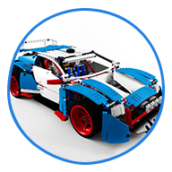

#  BLE_Car

Project include 3 software modules:
- Xamarin C# app for Android,
- Program for Microcontroller ATtiny2313 wrote in C,
- Program for Microcontroller ATtiny13 wrote in C.

Repository also contain a schematic print of designed electronic circuit.

Project based on LEGO 42077 set.

Added custom motor and servo motor.

The main supply is 12 V VRLA battery with a capacity of 1.3 Ah.

Motor is powered by 12 V, but electronic components like microcontrollers, motor driver and BLE module are powered by 5 V.

For testing, circuit is setup on breadboard.

**Android App**

Xamarin Android App allows to:
- scan to find a BLE module of a car,
- connect with a car,
- control motorised function of a car,
- check BLE signal quality,
- check battery status. 

**ATtiny 2313**

This uC supports:
- reading and interpretation of BLE signals from Android App,
- controlling motor driver and servo,
- controlling LED system mounted on a car,
- sending battery status to android.

**ATtiny 13**

This uC supports:
- measuring battery status,
- sending result to main controller.

## Plans for the future:
- use a more efficient uC,
- design a PCB. 
